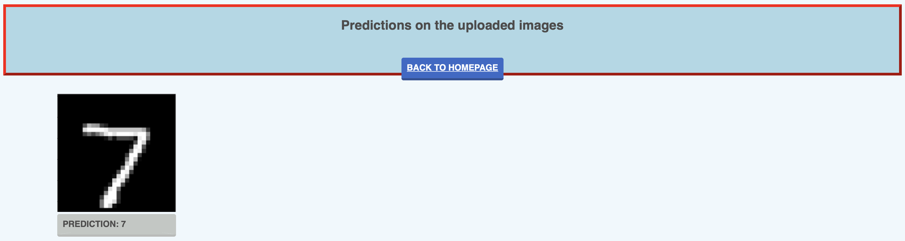

## simple MNIST classifier deployment with Flask and PyTorch

Small project to deploy a pytorch model on heroku, allowing for user inputs.<br> 
User interface will be minimal as this is not a project centered on HTML/css but more a personal project to learn about deploying ML models as web applications using heroku.<br><br>


## Usage

1. Head over to: https://cesare-mnist-simple-app.herokuapp.com/ (may take a couple of seconds to load)<br>
2. The homepage should look like the following:<br>
<br><br>
3. Hoover over ```choose files``` and upload an image (note that a simple CNN model was trained on MNIST, don't expect it to have superpowers)<br>
4. submit the image and click on ```get predictions``` to view the model's output, the final page should look like the following:<br>
<br><br>

## Contributors
@cesare.magnetti

